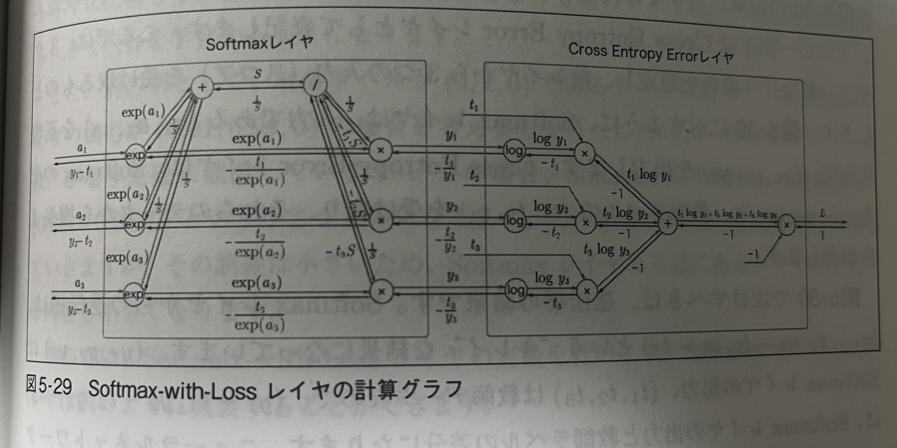

<script type="text/javascript" async src="https://cdnjs.cloudflare.com/ajax/libs/mathjax/3.2.2/es5/tex-mml-chtml.min.js">
</script>
<script type="text/x-mathjax-config">
 MathJax.Hub.Config({
 tex2jax: {
 inlineMath: [['$', '$'] ],
 displayMath: [ ['$$','$$'], ["\\[","\\]"] ]
 }
 });
</script>

# メモ
## chapter 2 「パーセプトロン」
- パーセプトロンとは？
    - 閾値を超えると1になってそれを発火という。
    - 同じ構造のパーセプトロンで AND、ORなどを再現できる。
- 線形性と非線形性
    - 二次元平面で描けばわかる話
- これでコンピュータの動作を再現できる
## chapter 3 「ニューラルネットワーク」
- 前章のパーセプトロンはパラメータを人力で設定していた。
    - これを自動で設定できるようにすることを「学習」という。
- 閾値処理は、「ステップ関数」を通していることと同じ
    - つまり、活性化関数の1つに過ぎない
- 活性化関数
    - シグモイド関数
    $$ h(x) = \frac{1}{1+exp(-x)} $$
    - ステップ関数
    - ReLu関数
    $$ h(x) = \max(0, x) $$
    
    - 両者は似ているが、滑らかさという点で違っている。
    - 線形関数だけを何層も重ねても、線形関数になるから意味ない。非線形関数で活性化することに意味がある。
- 行列の導入
    - パーセプトロンを行列で
    $$ \bold{y} = \bold{W} \bold{x} + \bold{b} $$
- 3層ニューラルネットワークの構築
    - init: パラメータと構成の初期化
    - forward: 順伝播
- 出力層の設計
    - 出力層の活性化関数は、タスクに応じて選ぶ必要がある。
    - 回帰問題: 恒等関数
    - 分類問題: ソフトマックス関数
    $$ y_i = \frac{exp(z_i)}{\sum_{j=1}^{N} exp(z_j)} $$
    - ソフトマックス関数は、出力の合計が1になるように変換する。
    - 実装面での注意
        - オーバーフロー対策として出力の最大値を全体から引いた上で指数計算をする
        - 推論時は、softmax関数を通さずにargmaxで最大値を求める
- 手書き文字認識
    - 推論処理のことを「順方向伝播」という。
    - python の import では、sys.path から探してくるということに注意！
    - 正規化
        - データをある範囲に収めること
        - 前処理のワンパターン
    - バッチ処理
        - 入力をある程度まとめて処理すること
        - 計算が速くなる (行列を使った演算になるから。for文と比べると速い。)
        - ```np.argmax(a, axis=1)``` で、1次元目を軸として最大値を求めることができる。

## chapter 4 「ニューラルネットワークの学習」
- データから学習
    - 画像分類を決定的なアルゴリズムでやるのは厳しい
    -　特徴量を抽出して、それを機械学習で分類する
        - SIFT, SURFなど人が考えた画像特徴量をもとにSVMなどで分類する
    - 画像特徴量を自動で学習するのがニューラルネットワーク
    - 訓練データとテストデータに分けて、テストデータで汎化性能を確認する
- 損失関数
    - 重み探索のための指標
    - 例
        - 2乗和誤差
        $$ L = \frac{1}{2} \sum_{i=1}^{N} (y_i - t_i)^2 $$
        - クロスエントロピー誤差
        $$ L = - \sum_{i=1}^{N} t_i log(y_i) $$
    - ミニバッチ学習
        - 訓練データに対して損失関数を求めるとき、一部のデータを使うこと
        $$ L = \frac{1}{N} \sum_{i=1}^{N} L_i $$
    - ニューラルネットワークの損失関数設定
        - なぜ認識精度を指標にしないのか？
            - パラメータの微分がほとんどの場所で0になってしまうから
            - 認識精度はとびとびの値になる
            - 連続的な値である損失関数を使う
- 数値微分
    - 数値の計算によって微分すること
    - 注意点
        - 微小な値だと丸め誤差が出る
        - 中心差分
        $$ \frac{f(x+h) - f(x-h)}{2h} $$

- 勾配法
    - 勾配を計算する
    - 勾配が示す方法は、各場所において関数の値を最も減らす方向
    - 勾配降下法
        - 勾配を使って、パラメータを更新する
        $$ \bold{W} = \bold{W} - \eta \frac{\partial L}{\partial \bold{W}} $$
        - $\eta$ は学習率

- 学習アルゴリズムの実装
    - 1. ミニバッチ、2. 勾配の算出、3. パラメータ更新、4. 繰り返し
    - ミニバッチで確率的に選んでくることを「確率的勾配降下法」と呼ぶ。(SGD)
    - 実際にこれで2層のMLPを実装して学習してみた
    - 数値微分では、誤差逆伝播法と比べてかなり時間がかかる

## chapter 5 「誤差逆伝播法」
重みパラメータの勾配計算を効率的にやる方法
- 計算グラフ
    - 基礎
        - 計算の流れをグラフで解いていくこと
        - 各ノードが計算を表していて、エッジがデータの流れを表している
        - 左から右に計算することを「順伝播」、右から左に計算することを「逆伝播」という
    - 特徴
        - 自分の周りの局所的な計算をするだけで全体の計算ができる。一つ一つの計算が単純に。
        - 計算の経過を保持できる
        - 逆方向の伝播によって、「微分」できる
- 連鎖律
    - 計算グラフにおいて、y = f(x) という計算があったときに、そこを逆伝播すると以下。
    $$ E -> E \frac{\delta y}{\delta x} $$
    - これを使うことで、各ノードの微分を計算できる
    - 連鎖律の定義
    $$ z = t^{2} $$
    $$ t = x + y $$
    がある時
    $$ \frac{\delta z}{\delta x} = \frac{\delta z}{\delta t} \frac{\delta t}{\delta x} $$
    $$ \frac{\delta z}{\delta x} = 2t \cdot 1 = 2(x+y) $$
- 逆伝播
    - 加算ノードの逆伝播
    $$ z = x + y $$
    $$ \frac{\delta z}{\delta x} = 1 $$
    - 乗算ノードの逆伝播
    $$ z = x \cdot y $$
    $$ \frac{\delta z}{\delta x} = y $$
    順伝播の時の値を使うから保持しておく必要がある
- 単純な実装
    - 加算レイヤー、乗算レイヤーなどレイヤー単位で、初期化、順伝播、逆伝播を実装する
- 活性化関数の逆伝播
    - ReLU
    $$ y = \max(0, x) $$
    $$ \frac{\delta y}{\delta x} = \begin{cases}
    0 & (x \leq 0) \\
    1 & (x > 0)
    \end{cases} $$
    - シグモイド関数
    $$ y = \frac{1}{1+exp(-x)} $$
    $$ \frac{\delta y}{\delta x} = y(1-y) $$
- Affineレイヤー、Softmaxレイヤー
    - Affineレイヤー (バッチ対応版)
    $$ Y = WX + B$$
    $$ \frac{\delta L}{\delta X} = \frac{\delta L}{\delta Y} \cdot W^{T} $$
    $$ \frac{\delta L}{\delta W} = X^{T} \cdot \frac{\delta L}{\delta Y}$$
    $$ \frac{\delta L}{\delta B} = \frac{\delta L}{\delta Y} の最初の軸に関する和$$
    - Softmax-with-Lossレイヤー
    複雑だけど綺麗に計算できる。
    
    - ソフトマックス + クロスエントロピー誤差の逆伝播
    $$(y_{1} - t_{1}, y_{2} - t_{2}, \cdots, y_{N} - t_{N})$$
    と綺麗で素直な形になる。
- 実装
    - 各レイヤーを `OrderedDict` で管理することでそれらを順番に `forward` か `backward` で計算することができる。
    - 実装が容易な数値微分を実装しておくことで、誤差逆伝播法の実装が正しいかどうかを確認することができる。
    - この作業を勾配確認という。

## chapter 6 「学習に関するテクニック」
- パラメータの更新
    - 損失関数を最小にするパラメータを見つけることを「最適化」という。
    - SGD (Stochastic Gradient Descent)
        - 確率的勾配降下法
    $$ \bold{W} = \bold{W} - \eta \frac{\partial L}{\partial \bold{W}} $$
    - ※実装する上では、最適化を行うクラスを分離して実装しておくとモジュールの入れ替えがしやすく便利
    - SGDの欠点：探索経路が非効率的になる   
    - Momentum
        - 常に速度のような変数を保持しておいてそれに応じてパラメータを更新する
        $$ v = \alpha v - \eta \frac{\partial L}{\partial \bold{W}} $$
        $$ \bold{W} = \bold{W} + v $$ 
        - 常に同じ方向に少しずつ加速していくので、ジグザグが減る
    - AdaGrad
        - パラメータの要素ごとに適応的に学習係数を調整する
        $$h = h + \frac{\partial L}{\partial \bold{W}} \cdot \frac{\partial L}{\partial \bold{W}}$$
        $$\bold{W} = \bold{W} - \frac{\eta}{\sqrt{h}} \frac{\partial L}{\partial \bold{W}}$$
        - 学習を進めていくと、学習率が小さくなっていく
    - Adam
        - Momentum と AdaGrad を組み合わせたもの
        $$ v = \beta_{1} v + (1 - \beta_{1}) \frac{\partial L}{\partial \bold{W}} $$
        $$ h = \beta_{2} h + (1 - \beta_{2}) \frac{\partial L}{\partial \bold{W}} \cdot \frac{\partial L}{\partial \bold{W}} $$
        $$ \bold{W} = \bold{W} - \frac{\eta}{\sqrt{h}} \frac{v}{1 - \beta_{1}^{t}} $$
        - これを使うことで、学習率の調整が自動で行われる
    

- 重みの初期化
    - 重みの初期値を全て0にするとどうなる？
        - 全てのノードが同じ値になるので、全てのノードが同じように学習してしまう
    - 隠れ層の活性化関数の後の出力データの分布 (アクティベーション分布)
        - 勾配消失：たとえばシグモイドで0か1に近すぎると勾配の値がほとんど0になってしまう
        - 表現力の制限: 標準偏差が小さすぎると、出力の分布が偏り、ニューロン間の表現力が制限される
    - Xavier の初期化
        - 重みの初期値を前層ノードの数 n を使って、標準偏差を$\sqrt{\frac{1}{n}}$にする
        - これは線形であるときに有効。つまり、Sigomoid や tanh の場合、
    - He の初期化
        - ReLU の場合は、標準偏差を$\sqrt{\frac{2}{n}}$にする

- Batch Normalization
    - 強制的にActivationの分布を調整すること
    - 利点：
        - 学習が早くなる
        - 初期値に依存しなくなる
        - 過学習を抑制する
    - 更新の式
    $$ \mu_{B} = \frac{1}{m} \sum_{i=1}^{m} x_{i} $$
    $$ \sigma_{B}^{2} = \frac{1}{m} \sum_{i=1}^{m} (x_{i} - \mu_{B})^{2} $$
    $$ \hat{x}_{i} = \frac{x_{i} - \mu_{B}}{\sqrt{\sigma_{B}^{2} + \epsilon}} $$

- 正則化
    - 過学習を抑制すること
    - 過学習の要因
        - モデルの表現力が高すぎる
        - 訓練データが少ない
    - 正則化の手法
        - Weight Decay
            - 大きな重みを持つことにペナルティを課すような損失関数を設定する
            - 重みのノルムを足す
            $$L = L_{0} + \frac{\lambda}{2} \sum_{i=1}^{N} W_{i}^{2}$$
        - Dropout
            - ニューロンをランダムに消去しながら学習する方法
            - 訓練時にはランダムにニューロンを削除して、テスト時には全てのニューロンを使う
            - 実質的にアンサンブル学習 (複数のモデルを組み合わせて学習すること) を行っている
- ハイパーパラメータの検証
    - ハイパーパラメータは、学習率や重みの初期値など、学習に影響を与えるパラメータ
    - 往々にして試行錯誤によってハイパーパラメータは探索される
    - 学習データセットを分割して、訓練データと検証データを作成する
        - 検証データを使って、ハイパーパラメータの調整を行う
    - 最適化の方法
        - ランダムにサンプリングして、手動で徐々に範囲を絞り込んでいく
        - ベイズ最適化

## Chapter6 内容重くて実装完全に追えてない感じあるので要復習！！！！！！
## Chapter 7 「畳み込みニューラルネットワーク」
- 全体の構造
    - Convolution Layer (畳み込み層)
    - Pooling Layer (プーリング層)
    - Affine Layer (全結合層) なども使う
- 畳み込み層
    - 全結合層では2次元のデータを1次元にするため、データの形状が無視される
    - 入出力を「特徴マップ」という。
    - 畳み込み演算：フィルタを動かしながら積和演算を行う
    - パディング (P) ：フィルタを動かすために、周りに0を追加すること
    - ストライド (S) ：フィルタを動かすときの移動量
    $$ OH =  \frac{H + 2P - FH}{S} + 1 $$
    $$ OW =  \frac{W + 2P - FW}{S} + 1 $$
    - 入力チャネル: 入力にチャネルがある場合は、チャネルが3次元方向に広がる3次元データを扱うことになる
    - 出力チャネル: フィルタの数を出力チャネルと呼ぶ
    - さらにバッチ処理も考えることで、入出力は4次元のデータを扱うことになる
    $$ \text{入力} = (N, C_{in}, H_{in}, W_{in}) $$
    $$ \text{フィルタ} = (C_{in}, C_{out}, FH, FW) $$
    $$ \text{出力} = (N, C_{out}, H_{out}, W_{out}) $$

- プーリング層
    - 学習するパラメータがない、チャンネル数は変化しない
    - プーリングの種類
        - Max Pooling: 最大値を取る
        - Average Pooling: 平均値を取る
- 実装編
    - `im2col`: 4次元のデータから行列計算に持っていくため、2次元に変換する処理が必要
    - `col2im`: 2次元のデータを4次元に戻す処理
    - `Convolution` クラス
        - フィルタの初期化、順伝播、逆伝播を実装する
    - `Pooling` クラス
        - プーリングの初期化、順伝播、逆伝播を実装する
- CNN の可視化
    - フィルタを可視化することで、どのように学習しているかがわかる
    - 階層構造による情報抽出。物体認識などで8層のCNNを使うと...
        - 1層目: エッジ検出
        - 3層目: 物体のテクスチャ
        - 5層目: 物体の形状
        などのように段階を追って、だんだんと抽象化された情報を抽出できるようになる
    - 代表的なCNN
        - LeNet
            - 手書き数字認識のために開発された
            - 活性化関数にシグモイド関数を使っていて
            - サブサンプリング層がある
        - AlexNet
            - 活性化関数にReLUを使っていて、学習が早くなった
            - Dropoutを使って過学習を抑制している
            - LRN (Local Response Normalization) を使っている